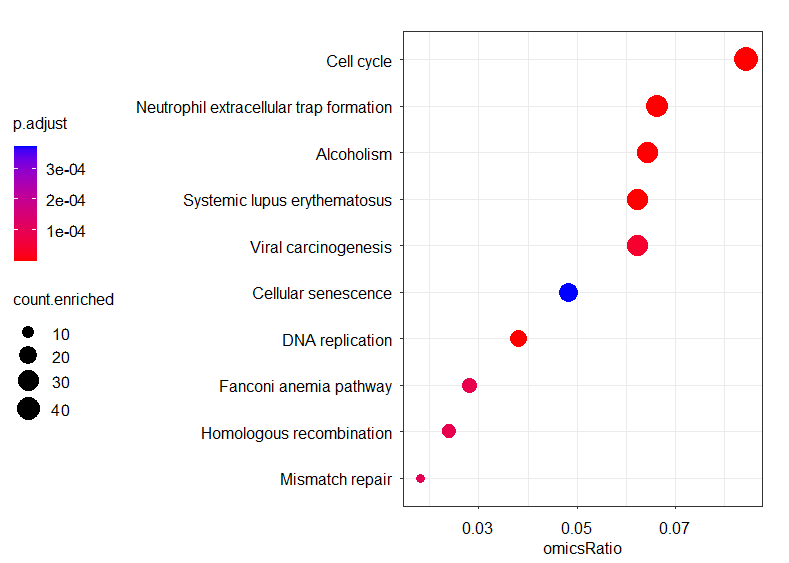
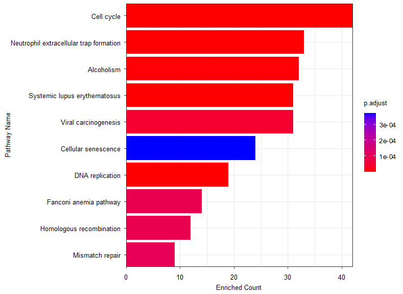

# OmicsPEA: An R Package for Pathway Enrichment Analysis (PEA) and Visualization of Omics Data

`OmicsPEA`is an R package designed for the visualization and analysis of pathway enrichment analysis (PEA) in omics data. It provides a comprehensive set of functions to explore and interpret high-throughput genomics, transcriptomics, proteomics, and metabolomics data in the context of biological pathways.

With `OmicsPEA`, researchers can perform pathway enrichment analysis to identify overrepresented biological pathways or gene sets that are significantly associated with their omics data. The package integrates various statistical methods and algorithms to assess the enrichment significance, including hypergeometric test, gene set enrichment analysis (GSEA), and functional class scoring.

One of the key features of `OmicsPEA` is its interactive and customizable visualization capabilities. It offers a range of visualization tools, such as pathway enrichment plots, gene set heatmaps, and network diagrams, allowing users to intuitively explore and interpret the enrichment results. These visualizations facilitate the identification of key pathways and genes contributing to the biological significance of the omics data.

Furthermore, OmicsPEA supports multiple omics data types and pathway databases, enabling researchers to analyze diverse types of omics data and utilize a wide range of pathway knowledge resources. The package seamlessly integrates with popular bioinformatics databases, such as [Kyoto Encyclopedia of Genes and Genomes (KEGG)](https://www.genome.jp/kegg/), [WikiPathways](https://www.wikipathways.org/), and [Reactome](https://reactome.org/).

In summary, `OmicsPEA` is a powerful R package that empowers researchers to perform pathway enrichment analysis on omics data, providing a comprehensive set of tools for visualization, statistical analysis, and interpretation of biological pathways. It facilitates the identification of key biological processes and pathways associated with omics data, aiding in the understanding of complex biological systems.

## Installation

You can install the development version from GitHub with:

``` r
# install.packages("devtools")
devtools::install_github("GitBioinformatics/OmicsPEA")
```

## OmicsPEA::PEA() Pathway Enrichment Analysis

`OmicsPEA::PEA()`makes it easy to do pathway enrichment analysis by use users their own pathway database.

### example one

``` r
# example one
library(OmicsPEA)

data(Metabolites)
data(Metabolites.Pathways)
colnames(Metabolites.Pathways) <- c('Metabolites', 'itemId', 'pathwayName')
enrich.res = PEA(omics.id.set = Metabolites$ID, omics.pathway.db = Metabolites.Pathways, min.enrich.size = 1)
head(enrich.res)
```

```R
> head(Metabolites.Pathways)
# A tibble: 6 × 3
  Metabolites                     itemId pathwayName                                          
  <chr>                           <chr>  <chr>                                                
1 1,25-Dihydroxyvitamin D3        M001   Vitamin D (Calciferol) Metabolism                    
2 11,12-Epoxyeicosatrienoic acid  M002   Eicosanoid and Resolvin Metabolism                   
3 11-deoxycorticosterone          M003   Cholesterol, Cortisol, Non-Gonadal Steroid Metabolism
4 11-HETE                         M004   Eicosanoid and Resolvin Metabolism                   
5 12-HETE                         M005   Eicosanoid and Resolvin Metabolism                   
6 13S-hydroxyoctadecadienoic acid M006   Eicosanoid and Resolvin Metabolism   
```

### example two

``` r
# example two
# use gene_symbol as itemId
library(OmicsPEA)

data(Gene.Expression.Demo)
data(Wiki.Pathways)
colnames(Wiki.Pathways) <- c('GeneID', 'itemId', 'PathwayID', 'pathwayName')
enrich.res = PEA(omics.id.set = Gene.Expression.Demo$gene_symbol, omics.pathway.db = Wiki.Pathways, min.enrich.size = 10)
head(enrich.res)
```

```R
> head(Wiki.Pathways)
  GeneID  itemId PathwayID                       pathwayName
1 574413  MIR409    WP4400           FABP4 in ovarian cancer
2   2167   FABP4    WP4400           FABP4 in ovarian cancer
3   4690    NCK1      WP23 B Cell Receptor Signaling Pathway
4   5781  PTPN11      WP23 B Cell Receptor Signaling Pathway
5  11184  MAP4K1      WP23 B Cell Receptor Signaling Pathway
6   6195 RPS6KA1      WP23 B Cell Receptor Signaling Pathway
```

### example three

```R
# example three
# use gene_id as itemId
library(OmicsPEA)
library(org.Hs.eg.db)
library(AnnotationDbi)

data(Gene.Expression.Demo)
data(KEGG.Pathways)
colnames(KEGG.Pathways) <- c('itemId', 'gene_symbol', 'PathwayID', 'pathwayName')
Gene.Expression.Demo$gene_id <- mapIds(org.Hs.eg.db, Gene.Expression.Demo$gene_symbol, column = "ENTREZID", keytype = "SYMBOL")
enrich.res = PEA(omics.id.set = Gene.Expression.Demo$gene_id, omics.pathway.db = KEGG.Pathways, min.enrich.size = 10)
head(enrich.res)
```

```R
> head(KEGG.Pathways)
  itemId gene_symbol PathwayID                  pathwayName
1  10327      AKR1A1  hsa00010 Glycolysis / Gluconeogenesis
2    124       ADH1A  hsa00010 Glycolysis / Gluconeogenesis
3    125       ADH1B  hsa00010 Glycolysis / Gluconeogenesis
4    126       ADH1C  hsa00010 Glycolysis / Gluconeogenesis
5    127        ADH4  hsa00010 Glycolysis / Gluconeogenesis
6    128        ADH5  hsa00010 Glycolysis / Gluconeogenesis
```

## Visualization

### dotplot

Plot dotplot for enrichment result by use `ggplot2` package.

```R
library(OmicsPEA)
library(org.Hs.eg.db)
library(AnnotationDbi)

data(Gene.Expression.Demo)
data(KEGG.Pathways)
colnames(KEGG.Pathways) <- c('itemId', 'gene_symbol', 'PathwayID', 'pathwayName')
Gene.Expression.Demo$gene_id <- mapIds(org.Hs.eg.db, Gene.Expression.Demo$gene_symbol, column = "ENTREZID", keytype = "SYMBOL")
PEA.RES = PEA(omics.id.set = Gene.Expression.Demo$gene_id, omics.pathway.db = KEGG.Pathways, min.enrich.size = 10, ratio.numeric = FALSE)

dotplot(
  obj = PEA.RES,
  x = 'omicsRatio',
  color.by = 'p.adjust',
  point.size.by = 'count.enriched',
  order.by = 'x',
  order.decreasing = TRUE,
  order.show = 10,
  legend.size.title = NULL,
  legend.color.title = NULL,
  legend.position = 'left',
  legend.direction = 'vertical',
) + guides(size  = guide_legend(order = 2), color = guide_colorbar(order = 1)) +
  theme(
    plot.margin = margin(t = 5, r = 20, b = 5, l = 5, unit = 'points')
  )
```



### barplot

Plot barplot for enrichment result by use `ggplot2` package.

```R
library(OmicsPEA)
library(org.Hs.eg.db)
library(AnnotationDbi)

data(Gene.Expression.Demo)
data(KEGG.Pathways)
colnames(KEGG.Pathways) <- c('itemId', 'gene_symbol', 'PathwayID', 'pathwayName')
Gene.Expression.Demo$gene_id <- mapIds(org.Hs.eg.db, Gene.Expression.Demo$gene_symbol, column = "ENTREZID", keytype = "SYMBOL")
PEA.RES = PEA(omics.id.set = Gene.Expression.Demo$gene_id, omics.pathway.db = KEGG.Pathways, min.enrich.size = 10, ratio.numeric = FALSE)

colnames(PEA.RES)
barplot(
  obj = PEA.RES,
  x = "count.enriched",
  color.by = 'p.adjust',
  order.by = 'x',
  order.decreasing = TRUE,
  order.show = 10,
  font.size = 10,
  x.title = 'Enriched Count',
  y.title = NULL,
  legend.size.title = NULL,
  legend.color.title = NULL,
  legend.position = 'right',
  legend.direction = 'vertical'
)
```




